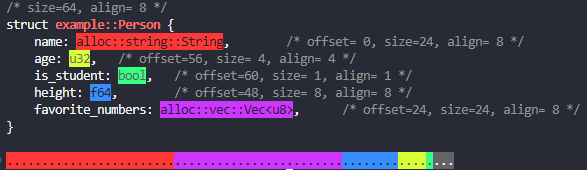
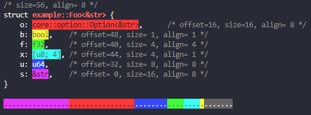
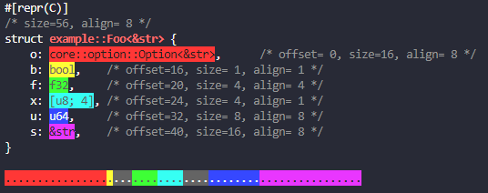
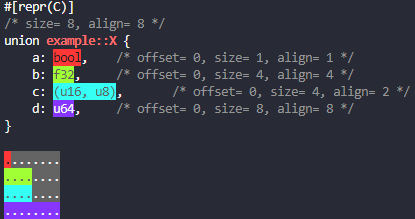

# struct_scalpel
[](https://github.com/DragonFighter603/struct_scalpel)
[](https://crates.io/crates/struct_scalpel)
[](https://github.com/DragonFighter603/struct_scalpel/blob/main/LICENSE)
[](https://github.com/DragonFighter603/struct_scalpel/stargazers)

<!-- 
[](https://docs.rs/struct_scalpel)
-->
---
Memory layout analysis tool for rust structs, enums, unions, tuples, and references, prints to console using ansi escape codes.

Simply derive `Dissectible` and call `print_dissection_info` to get a well formatted overview.

```rs
use struct_scalpel::{Dissectible, print_dissection_info};

#[derive(Dissectible)]
struct Person {
    name: String,
    age: u32,
    is_student: bool,
    height: f64,
    favorite_numbers: Vec<u8>,
}

fn main() {
    print_dissection_info::<Person>();
}
```



With `dissect_std` you can even disect some std items, with only a few type path deviations for private types.
- String
- Option<T>
- Result<T, E>
- Box<T, A: Allocator>
- Rc<T>
- cell
    - UnsafeCell<T>
    - Cell<T>
    - RefCell<T>
    - OnceCell<T>
- sync
    - OnceLock<T>

Disclaimer: This may not work in all cases, such as where some fields are unsized or dependant on a sys (os) implementation

This also works with generics and different layout strategies





